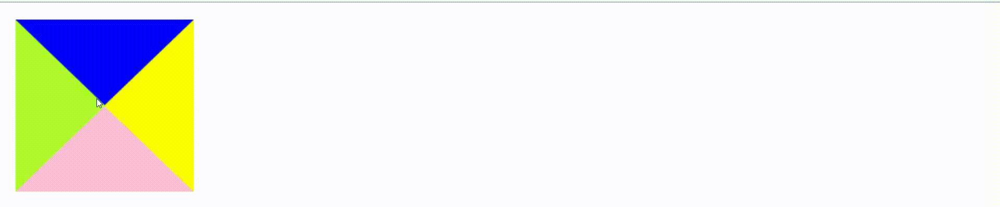

# 用`CSS3`来实现一个轮播图

我们经常在网页端看到关于轮播图的实现。

那么我们能否使用`CSS3`的动画来实现一个轮播图呢。

来看文章吧~



## 动画

### `@keyframe`

动画是为了将元素的样式从一种状态，改变到另一种状态而得到的。

在动画中，我们规定了`from`和`to`来实现元素样式的改变。

同样，我们还可以通过0~100%的方式实现对动画的更细粒度的划分。

如下方代码一样，我们将会对样式的颜色进行变化。

**注意：对于`@keyframe`属性而言，需要对`Safari`,`Chrome`，`Opera`和`Firefox`浏览器进行兼容的处理。**

```css
@keyframes myfirst
{
	0%   {background: red;}
	25%  {background: yellow;}
	50%  {background: blue;}
	100% {background: green;}
}
```

### `animation`

在我们完成对动画的规定以后还需要将`@keyframe`规定的动画绑定到相应的选择器中。

在绑定到相应的选择器时，还能够规定所需动画的时长与名称。

如下例子,也就表示`switch`轮播效果会在5s内进行触发

```css
animation : switch 5s  
```

对于`animation`还有其他的属性。

|            属性             |      效果      |            常见值            |
| :-------------------------: | :------------: | :--------------------------: |
|      `animation-name`       |    动画名称    |                              |
|    `animation-duration`     |    动画周期    |                              |
| `animation-timing-function` | 动画的速度曲线 | 默认`ease`慢开，快速，慢结束 |
| `animation-iteration-count` |  动画播放次数  |       `infinite`或n次        |

## 轮播图的思路

至此，我们准备好了`CSS3`的基础知识，那么轮播图又该如何设计？

我们来分析，对于轮播的动画也就是将图片的样式进行改变，轮播本质上是图片的左右移动，那么也就可以通过`margin-left`取负值的形式来实现图片的轮播处理。

于是有了这样的初步代码

```html
//定义三个图片节点并赋予样式


<style>
	img {
   	 	width: 200px;
    	float: left;
    	height: 200px;
  	}
    @keyframes switch {
    0%,25% {
      margin-left: 0;
    }
    35%,65% {
      margin-left: -200px;
    }
    75%,100% {
      margin-left: -400px;
    }
  }
</style>  

```

但这样还不够，我们要对这样的动画进行绑定，这也就需要在图片外层定义一个可以容纳三个图片的容器。

```html
<div id="pictures">
      
      
      
 </div>
<style>
#pictures {    
     	/* 轮播动画名、周期3s、动画慢入慢出、无限轮播 */
    	animation: switch 3s ease-in-out infinite;
    }
img {
    	width: 200px;
    	float: left;
    	height: 200px;
  	}
@keyframes switch {
    0%,25% {
     	 margin-left: 0;
    }
    35%,65% {
      	margin-left: -200px;
    }
    75%,100% {
      	margin-left: -400px;
    }
</style>
```

但这样还是并不正确，我们所要轮播的只有一个图片，于是我们需要在最外层再套上一层容器。

同时对于动画的`animation`和`@keyframe`来讲该需要继进行一些浏览器兼容的处理。

完整的代码如下

```html
  <div id="container">
    <div id="pictures">
      
      
      
    </div>
  </div>
  <style>
  #container {
    width: 200px;
    overflow: hidden;
  }
  #pictures {
    width: 600px;
    /* 轮播动画名、周期3s、动画慢入慢出、无限轮播 */
    animation: switch 3s ease-in-out infinite;
    /* Firefox */
    -moz-animation: switch 3s ease-in-out infinite;
    /* Chrome */
    -webkit-animation: switch 3s ease-in-out infinite;
    /* Opera */
    -o-animation: switch 3s ease-in-out infinite;
  }

  @keyframes switch {
    0%,25% {
      margin-left: 0;
    }
    35%,65% {
      margin-left: -200px;
    }
    75%,100% {
      margin-left: -400px;
    }
  }
  @-moz-keyframes switch {
    0%, 25% {
      margin-left: 0;
    }
    35%,65% {
      margin-left: -200px;
    }
    75%,100% {
      margin-left: -400px;
    }
  }
  @-webkit-keyframes switch {
    0%,25% {
      margin-left: 0;
    }
    35%,65% {
      margin-left: -200px;
    }
    75%,100% {
      margin-left: -400px;
    }
  }

  @-o-keyframes switch {
    0%,25% {
      margin-left: 0;
    }
    35%,65% {
      margin-left: -200px;
    }
    75%,100% {
      margin-left: -400px;
    }
  }
  img {
    width: 200px;
    float: left;
    height: 200px;
  }
</style>
```


