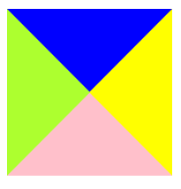
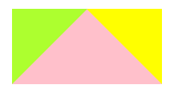

# 使用纯`CSS`来绘制三角形

每一个前端都是用过`border`来绘制元素的边框，就像`border:1px solid black`这行代码一样，绘制一个宽度时`1px` ，实体的，黑色的边框。

**但边框真的只是一条线么？能不能用`border`做一些其他的呢？来仔细看文章吧~ **

## 探索`border`

来看这样的代码，当我们将块级元素的`width`与`height`很小，而`border`很大的时候，会发生什么？

```css
<div class="border"></div>
    .border {
      width: 10px;
      height: 10px;
      border-top: 50px solid blue;
      border-right: 50px solid yellow;
      border-bottom: 50px solid pink;
      border-left: 50px solid greenyellow;
    }
```

答案就跟我们的绘制三角形有关，如图，我们看到`border`实际并不是一条边框线，而是由`width`或是`height`为顶、以`border`为高度的梯形。


## 五颜六色的正方形

那么当`width`或是`height`清0时，又会发生什么？

聪明如你，一定懂了，四个顶点对其的三角形。

```css
  <div class="triangle0"></div>
    .triangle0 {
      margin-left: 40%;
      width: 0;
      height: 0;
      border-top: 50px solid blue;
      border-right: 50px solid yellow;
      border-left: 50px solid greenyellow;
      border-bottom: 50px solid pink;
    }
```



## 第一个三角形

所以，我们如果将其他三个三角形的`border`颜色设置全透明也就是`transparent`就可以绘制出三角形了。

```css
 <div class="triangle1"></div>
    .triangle1 {
      margin-left: 40%;
      width: 0;
      height: 0;
      border-top: 50px solid transparent;
      border-right: 50px solid transparent;
      border-left: 50px solid transparent;
      border-bottom: 50px solid pink;
    }
```


但仅仅如此，并不是最好的三角形，往下看

## 更好的三角形

到这里我们做个尝试，将`border-top`属性注释掉，得到的结果会怎样。

```css
  <div class="triangle2"></div>
    .triangle2 {
      margin-left: 40%;
      width: 0;
      height: 0;
      /* border-top: 50px solid transparent; */
      border-right: 50px solid yellow;
      border-left: 50px solid greenyellow;
      border-bottom: 50px solid pink;
    }
```




在这里能够发现，当顶端的`border-top`注释掉后，左侧的`border-left`与右侧的`border-right`均少了一半，这也就是`border`的精妙所在。在整个块中一个`border`将会影响到他两侧的`border`的展示。

于是也就诞生了更好的三角形。

```css
<div class="triangle3"></div>
    .triangle3 {
      margin-left: 40%;
      width: 0;
      height: 0;
      border-right: 50px solid transparent;
      border-left: 50px solid transparent;
      border-bottom: 50px solid pink;
    }
```


## 直角三角形

最后来想一想直角三角形如何完成吧，参考上面的**更好的三角形**这一部分。

一定要自己思考，思考后才会将知识掌握在自己脑海中。

```css
<div class="rightTriangle"></div>
    .rightTriangle {
      margin-left: 40%;
      width: 0;
      height: 0;
      border-bottom: 50px solid pink;
      border-top: 50px solid transparent;
      border-right: 50px solid transparent;
    }
```


