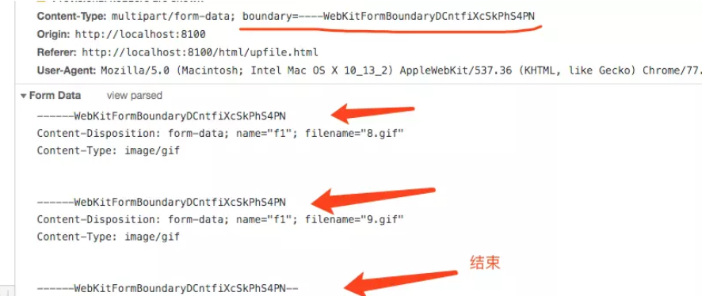
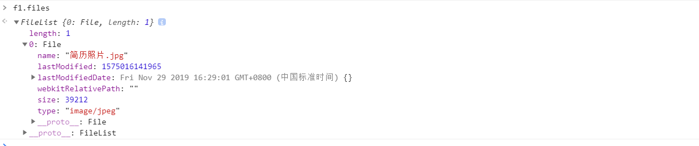
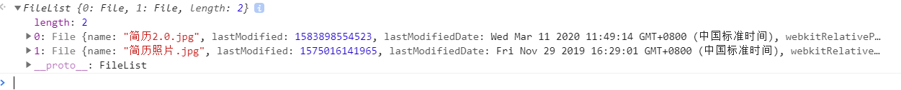

# 文件上传

## 文件上传原理

文件上传的原理，就是`DOM`中的`FileUpload`对象。就是这句

`<input type="file">`

但仅仅这样并不足够。

文件上传本质上是需要按照特定的`HTTP`请求格式来处理文件，也就是在表单中将`enctype="multipart/form-data"`来实现。

> `multipart`互联网上的混合资源，就是资源由多种元素组成，form-data表示可以使用HTML Forms 和 POST 方法上传文件，具体的定义可以参考RFC 7578。

当我们设置该属性后，请求体也发生了变化。

能够看到使用`multipart/form-data`上传文件中将会采用`boundary`来进行文件的分块处理。



## 同步的文件上传

如下写法在`IE`时代将会是首选，采用`form`表单的同步上传功能实现文件的上传。

```html
<form action="http://localhost:8100" method="POST" enctype="multipart/form-data">
	<input type="file" name="f1" id="f1">
    <input type="submit" id="bth">
</form>
```

我们用这个例子来理解下`<input tyep="file">`。我们将该元素打印出来。

```javascript
let f1 = document.getElementById("f1")
console.log(f1.files)
```

如图所示，能够以数组的形式看到我们所选中的文件内容。



但这只是单文件的上传，对于多文件只需在标签中添加一个`multiple`即可。

```html
  <form action="http://127.0.0.1:1337" method="POST" enctype="multipart/form-data">
    <input type="file" name="f1" id="f1" multiple>
    <input type="submit" id="bth">
  </form>
</body>
<script>
  let f1 = document.getElementById("f1")
  console.log(f1.files)
</script>
```



## 异步的文件上传

上述只是文件的同步上传，但现在我们大多采取`XMLHttprequest`来进行异步的文件上传。

使用`XMLHttprequest`2进行文件上传在此简要介绍`XMLHttpRequest`所达到的好处。

+ 引入`fileData`类型来管理表单上传。
+ 新增`xhr.upload.onprogress`进行回调来实现上传进度的监听。
+ 可设置`ontimeout`来防止超时。

+ 依旧收同源策略影响，但可以在后端配置`CORS`来实现跨域。

```html
<body>
  <input type="file" name="f1" id="f1" multiple>
  <button id="btn">上传</button>
</body>
<script>
  let btn = document.getElementById("btn")

  function upLoad() {
    let files = document.getElementById("f1").files
    let fileData = new FormData()
    let xhr = new XMLHttpRequest()
    for (let i = 0; i < files.length; i++) {
      fileData.append("files", files[i])
    }
    xhr.onreadystatechange = function () {
      if (xhr.readyState === 4) {
        if (xhr.status >= 200 && xhr.status < 300) {
          //上传成功
        }
      }
    }
    xhr.open("POST", "http://127.0.0.1:1337", true)
    xhr.send(fileData)
  }
  btn.addEventListener("click", function () {
    upLoad()
    console.log("发起上传")
  }, false)
</script>
```

## 文件上传的进度

为了监控文件上传的进入，也就需要调用`xhr.onload.onprogress`方法进行上传百分比的计算。

```javascript
xhr.upload.onprogress = function (e) {
     if(e.lengthComputable) {
      var percentComplete = (e.loaded / e.total) * 100;
       // 对进度进行处理
     }
  }
```

## 文件上传的拖拽

大体思路就是对拖拽的三个事件`dragenter`,`dragover`,`drop`进行监听，阻拦浏览器默认的拖拽打开事件，并阻止冒泡。最后获取到拖拽的文件。

```html
<div id="dragBox" style="width: 300px;height: 300px; background-color: blanchedalmond;"></div>
```

```javascript
let dragBox = document.getElementById("dragBox")
  dragBox.addEventListener("dragenter", handleDragenter, false)
  dragBox.addEventListener("dragover", handleDragover, false)
  dragBox.addEventListener("drop", handleDrop, false)  
function handleDragenter(e) {
    // 阻止浏览器默认拖拽进入事件、并防止冒泡
    e.stopPropagation()
    e.preventDefault()
  }

function handleDragover(e) {
    // 阻止浏览器默认拖拽覆盖事件、并阻止冒泡
    e.stopPropagation()
    e.preventDefault()
  }

function handleDrop(e) {
    // 阻止浏览器默认放下事件、并阻止冒泡
    e.stopPropagation()
    e.preventDefault()
    // 获取拖拽的文件
    let files = e.dataTransfer.files
  }
```

## 文件上传的预览

关于文件上传后的预览方式有很多，可以前后端联合，前端上传结束后再从后端获取图片。

也可以利用H5新增的`FileReader`来进行文件的读取。

```html
  <input type="file" name="f1" id="f1" multiple>
  <div id="preview"></div>

<script>
  document.getElementById("f1").addEventListener("change", function () {
    let preview = document.getElementById("preview")
    let img = document.createElement("img")
    let fileInput = document.getElementById("f1")
    let file = fileInput.files[0]
    img.width = 100
    img.height = 100
    preview.appendChild(img)
    // 使用H5的FileReader对象
    let reader = new FileReader()
    // 开始读取指定Blog中的内容
    reader.readAsDataURL(file)
    reader.onload = (e) => {
      img.src = e.target.result
    }
  }, false)
</script>
```

效果如图啦~~

<video src="upload/文件预览.mp4"></video>