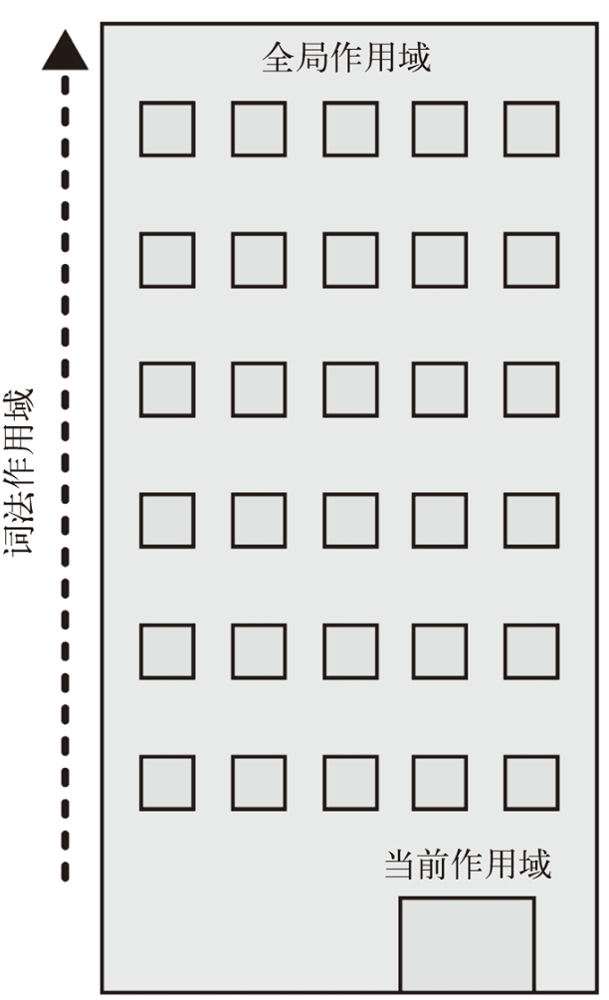

## `JavaScript`程序的执行

1. 三个关键人物
   + 引擎：负责程序的编译和执行。
   + 作用域：负责**搜集和维护一系列变量的查询。**
   + 编译器：语法分析和词法分析生成抽象语法树。

2. `var a = 2;`的执行
   + 编译器在作用域中声明变量。
   + 引擎在作用域中查询变量，若查询到对其赋值。

## `LHS`查询和`RHS`查询

+ `LHS`，找到变量容器。一般是赋值操作。

  ```var a = 2;```

+ `RHS`，查询变量本身的值。一般是赋值符号右侧。

  ```console.log(a)```

+ **异常**
  + 对于`LHS`而言，在非严格模式下查询不到变量会将其声明。在严格模式下查询不到将会报出`ReferenceError`的错误。
  + 对于`RHS`而言，查询不到变量直接报出`ReferenceError`的错误。对变量不合理操作时将会报出`TypeError`的错误。

## 作用域的嵌套

**遍历作用域链的规则：引擎查询变量时，从当前作用域查询，若查询不到则向上一级作用域查询，直到查询到全局作用域为止。**

