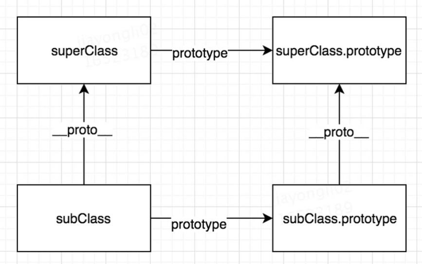

# 继承

## 构造函数继承

子类中通过`call`或者`apply`调用父类的构造函数。但缺陷在于方法会重定义，不可复用。

```javascript
// 构造函数继承
function Father(name) {
  this.name = name
  this.sayName = function () {
    console.log(name)
  }
}
function Son(name) {
  Father.call(this, name)
}
let i = new Son("Bob")
let j = new Son("Bob")
console.log(i.sayName === j.sayName)//false
```

## 原型继承

子类的原型指向父类的实例。缺陷在于引用类型将会被共享，且定义一个子类时不能够向父类传递参数。

```javascript
// 原型链继承
function Father() {
  this.age = [0, 1, 2]
}
Father.prototype.sayName = function () {
  console.log(this.age)
}

function Son() {

}
Son.prototype = new Father()
let instance1 = new Son()
let instance2 = new Son()
instance2.age.push(0)
instance2.sayName()//[0,1,2,0]
instance1.sayName()//[0,1,2,0]
```

*注意：`push`只改变内存堆的值不改变内存栈中的地址。而`=`将为数组重新赋新的内存栈地址。*

## 组合继承

构造函数+原型继承。构造函数继承实例属性，原型继承共享属性和方法。缺点在于调用两次父类的构造函数。

```javascript
// 组合继承
function Father() {

}
Son.prototype = new Father()//第一次

function Son() {
  Father.call(this)//第二次
}
```

## 原型式继承`Object.create()`

利用构造函数，传入一个对象，让该对象等于构造函数的原型，返回出构造函数的实例。相当于进行一次浅拷贝。缺点在于俩对象间的共享。

```javascript
function Object.create(obj){
    function F(){}
    F.prototype = obj
    return new F()
}
```

## 寄生组合继承

利用原型式继承得到超类实例的副本，将该副本指向子类的原型。**最好的继承方法**

```javascript
function Object.create(obj){
	function F(){}
	F.prototype = obj
	return new F()
}
function inherit(Son,Father){
	let sonPrototype = Object.create(Father)
	Son.prototype = sonPrototype
	sonPrototype.constructor = Son
}
```

## ES6的`extend`

`ES6`新引入类`class`的概念，在`Class`中使用`constructor`定义属性。在`constructor`外定义的方法均在`class.prototype`上。在子类中可以使用`extends`进行继承。由于子类没有自己的`this`，因此还需要使用`super`来指向父类。

`ES6`继承得到结果如图。

`subClass._proto_ === superClass`用于继承构造函数的属性。

`subClass.prototype._proto_ === superClass`用于继承原型对象方法。



```javascript
class SuperClass {
  constructor(name) {
    this.name = name
  }
  sayName() {
    console.log(this.name)
  }
}
class SubClass extends SuperClass {
  constructor(name, age) {
    super(name)
    this.age = age
  }
  sayAge() {
    console.log(this.age)
  }
}
let s = new SubClass("kk", 55)
console.log(s.sayName())	//"kk"
console.log(s.sayAge())		//55
```

