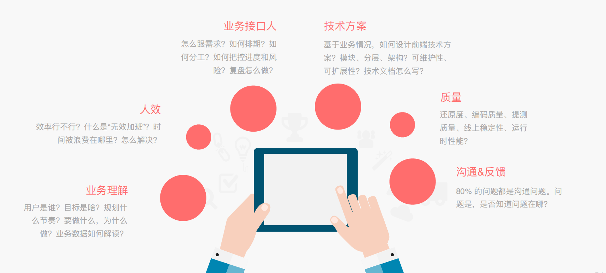
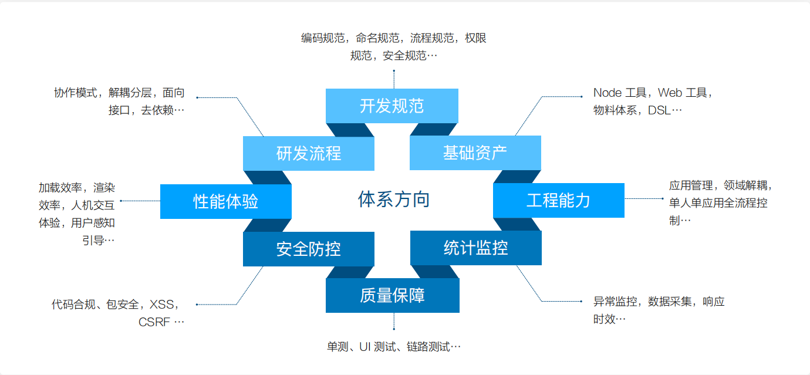
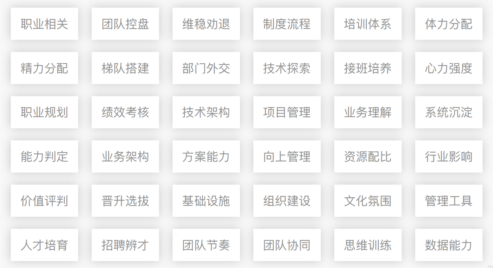

# 如何在初级到专家的礼尚打破成长瓶颈

By@堂主（淘宝任职、蘑菇街前端leader、政采云前端leader）

### 层级

阿里系：

P4：初级工程师。0~1年。实习生、除阿里、腾讯、字节的应届生。

+ 独立承担。（做完）

P5：高级工程师。1~3年。

+ 主动思考。（做好）

P6：资深工程师。2~5年。

+ 影响带动他人，帮助业务成长。（影响）

P7：技术专家。3~8年。

+ 体系成就，帮助团队成长，抓结果。（成就）

P8：高级技术专家。6~10年。

+ 体系化。

### 瓶颈与破局

1. P4到P5

   + 被动执行、做完就好：

     + 工作前两年积累业务，沉淀通用技术解决方案。

     + 做业务从做完到做好：从更多维护思考，成为一个好的业务接口人。

       

2. P5到P6（反哺与影响）

   + 做自己的事、潜意识设界
     + 技术上要有专项能力。
     + 从对内到对外，P5是汲取，P6是反哺。
     + P6之前是叫你去做，P6之后是我要去做。

3. P6到P7（改变团队）

   + 一个人结局问题、解决眼前问题

     + 技术上P6、P7、P8并无太大差异

     + 站在团队角度做规划，从影响到改变。

     + 体系化思维

       

4. P7到P8
   + 跨业务、跨部门

### 感悟

1. 业务与技术
2. 关于成长
   + 从场景出发找方案，事半功倍。

3. 关于晋升
   + 先去按照下一个层级思考问题。

4. 关于离职
   + 离职是匹配行为而非冲动行为。
5. 身价，取决于解决问题的能力
   + 业务架构推动
   + 流程制度的推进
   + 基础设施的建设

### 答疑