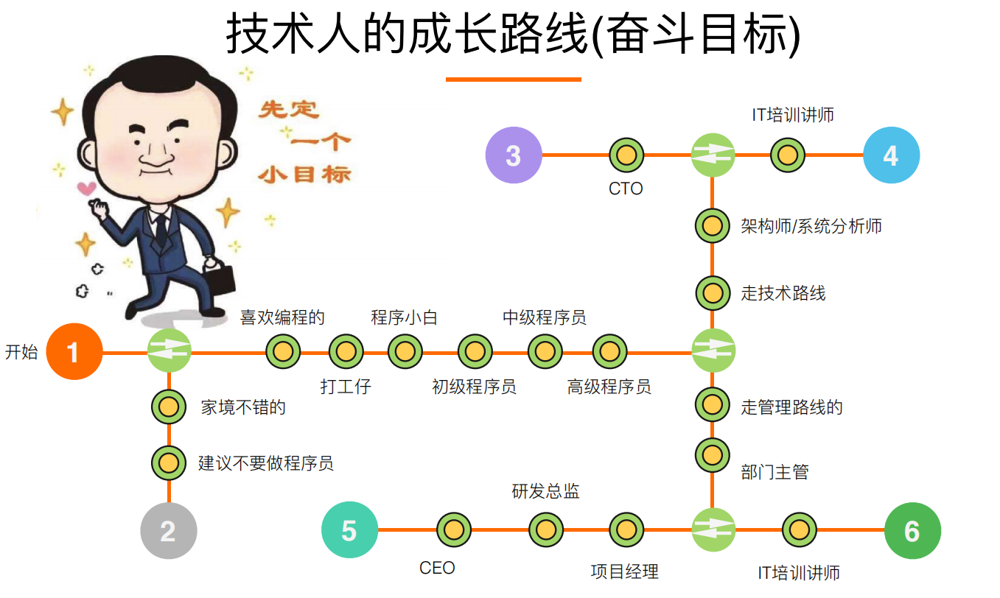
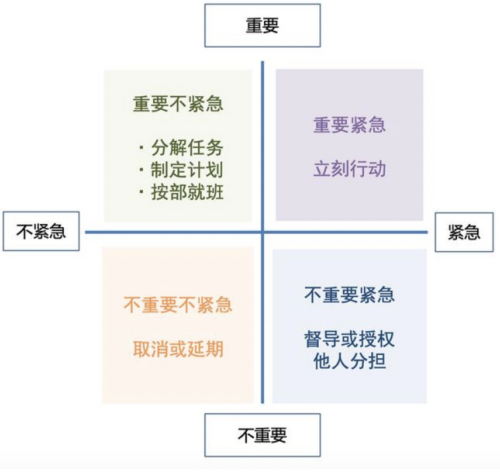
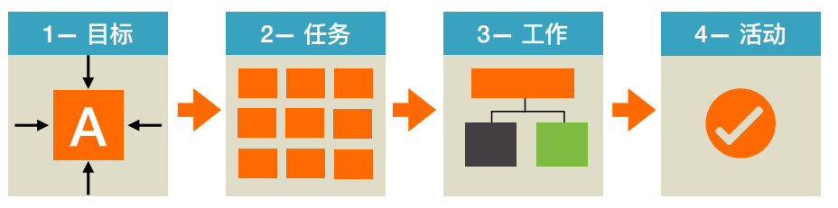

# 如何对P5/P6/P7做职业规划和技术规划

By@城池（百度、猎豹、阿里云）

### 如何做职业规划

不要过早做管理

### 职业规划与安排

P5

1. 计算机基础知识、框架使用原理、后端技术
2. 主动思考，把做完变成做好。

### 总结过去

1. 不知道自己不知道>知道自己不知道>知道自己知道>不知道自己知道。
2. 新媒体配合专注10000小时。
3. 厚积薄发、静下心来、减少跳槽。（三年两跳，五年三跳不可取。
4. 建立个人品牌、坚持每日总结。
5. 以战养兵。

### 模型

1. 时间管理

   

2. 工作分解

   

3. GROW与人沟通

