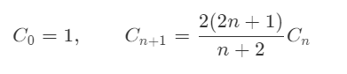

# `leetcode`刷题之旅

**算法就像内功，越深厚走的也就越远。**

## 第一天

**收获**

**1. 对于两次遍历的数组可以采取再次声明空数组的方式用空间来弥补时间。**

**2. 动态规划来计算数字的二进制中1的个数时，可以通过奇数或偶数来建立状态转移方程。偶数时1的个数与上其一半相同。奇数时1的个数是上一个数字中1的个数再加1.**

**3. 动态规划中经典的零钱问题，可以通过找到上一个硬币数目再加一的方式来得到动态转移方程。**

1. 两数之和

> 给定一个整数数组 nums 和一个目标值 target，请你在该数组中找出和为目标值的那 两个 整数，并返回他们的数组下标。
>
> 你可以假设每种输入只会对应一个答案。但是，你不能重复利用这个数组中同样的元素。
>
> 示例:
>
> 给定 nums = [2, 7, 11, 15], target = 9
>
> 因为 nums[0] + nums[1] = 2 + 7 = 9
>
> 所以返回 [0, 1]

思路：暴力求解的时间复杂度过高，将达到`O(n)=n²`。采取另一种方式，声明额外的数组，存储目标的差值，用额外的数组的空间来换取时间。

```javascript
function twoSum(nums, target) {
  if (!Array.isArray(nums)) throw ("Array")
  let temp = [],
    tempIndex = 0
  nums.forEach(item => {
    temp[tempIndex++] = target - item
  })
  for (let i = 0; i < nums.length; i++) {
    if (temp.indexOf(nums[i]) !== -1 && temp.indexOf(nums[i]) !== i) {
      return [i, temp.indexOf(nums[i])]
    }
  }
}
```

2. 比特位计数

> 给定一个非负整数 num。对于 0 ≤ i ≤ num 范围中的每个数字 i ，计算其二进制数中的 1 的数目并将它们作为数组返回。
>
> 示例 1:
>
> 输入: 2
> 输出: [0,1,1]
> 示例 2:
>
> 输入: 5
> 输出: [0,1,1,2,1,2]

思路：动态规划。找到状态转移方程。

要获取二进制的值，可分成奇数和偶数来考虑。

对于奇数，二进制是前一数加上一。

对于偶数，始终等于`2*dp[i/2]`

```javascript
function countBits(num) {
  if (typeof (num) !== "number") throw ("Not a Number")
  if (num === 0) return [0]
  if (num === 1) return [0, 1]
  let dp = new Array(num + 1)
  dp[0] = 0, dp[1] = 1
  for (let i = 2; i <= num; i++) {
    if (i % 2 === 0) {
      dp[i] = dp[i / 2]
    } else {
      dp[i] = dp[i - 1] + 1
    }
  }
  return dp
}
```

3. 零钱兑换

> 给定不同面额的硬币 coins 和一个总金额 amount。编写一个函数来计算可以凑成总金额所需的最少的硬币个数。如果没有任何一种硬币组合能组成总金额，返回 -1。
>
> 示例 1:
>
> 输入: coins = [1, 2, 5], amount = 11
> 输出: 3 
> 解释: 11 = 5 + 5 + 1
> 示例 2:
>
> 输入: coins = [2], amount = 3
> 输出: -1

思路：经典的动态规划。找到状态转义方程`dp[n] = dp[n-coin] + 1 `

```javascript
var coinChange = function(coins, amount) {
let dp = new Array(amount+1).fill(Infinity)
    dp[0] = 0
    for(let i = 1;i<=amount;i++){
        for(let coin of coins){
            if( i >= coin ){
                dp[i] = Math.min(dp[i],dp[i-coin]+1)
            }
        }
    }
    return dp[amount] === Infinity ? -1 : dp[amount]
};
```

## 第二天

1. 不同的二叉搜索树

> 给定一个整数 n，求以 1 ... n 为节点组成的二叉搜索树有多少种？
>
> 示例:
>
> 输入: 3
> 输出: 5
> 解释:
> 给定 n = 3, 一共有 5 种不同结构的二叉搜索树:
>
>    1         3     3      2      1
>     \       /     /      / \      \
>      3     2     1      1   3      2
>     /     /       \                 \
>    2     1         2                 3

解法一：

+ G(n): 长度为n的序列的不同二叉搜索树个数。

+ F(i,n): 以i为根的不同二叉搜索树个数。

  *G*(*n*)=*i*=1∑*n**F*(*i*,*n*)		①

  *G*(0)=1 , *G*(1)=1			  

  *F*(*i*,*n*)=*G*(*i*−1)⋅*G*(*n*−*i*)(2)	②

  将公式 ①，② 结合，可以得到 G(n)的递归表达公式：

  *G*(*n*)=*i*=1∑*n**G*(*i*−1)⋅*G*(*n*−*i*)

```javascript
var numTrees = function (n) {
    if (typeof n !== "number") throw ("Not a number!")
    let dp = new Array(n + 1).fill(0)
    dp[0] = 1, dp[1] = 1
    for (let i = 2; i <= n; i++) {
        for (let j = 1; j <= i; j++) {
            dp[i] += dp[j - 1] * dp[i - j]
        }
    }
    return dp[n]
};
```

解法二：

类似问题可使用卡塔兰数来解决。



```javascript
var numTrees = function(n) {
    let res = 1;
    for (let i = 0; i < n; i++) {
        res = 2 * res * (2 * i + 1) / (i + 2)
    }
    return res;
};
```

2. 最小路径和

> 给定一个包含非负整数的 m x n 网格，请找出一条从左上角到右下角的路径，使得路径上的数字总和为最小。
>
> 说明：每次只能向下或者向右移动一步。
>
> 示例:
>
> 输入:
> [
>   [1,3,1],
>   [1,5,1],
>   [4,2,1]
> ]
> 输出: 7
> 解释: 因为路径 1→3→1→1→1 的总和最小。

思路如下：经典的动态规划问题，每步的路径取决与上一步骤中较小的位置。

找到状态转义方程`dp[i][j] = grid[i][j] + Math.min(dp[i-1][j],dp[i][j-1])`

```javascript
function minPathSum(grid) {
  if (!Array.isArray(grid)) throw ("Not a array")
  let m = grid.length,
    n = grid[0].length
  let dp = Array.from(new Array(m).fill(0), () => new Array(n).fill(0))
  dp[0][0] = grid[0][0]
  for (let i = 1; i < n; i++) {
    dp[0][i] = grid[0][i] + dp[0][i - 1]
  }
  for (let j = 1; j < m; j++) {
    dp[j][0] = grid[j][0] + dp[j - 1][0]
  }
  for (let i = 1; i < m; i++) {
    for (let j = 1; j < n; j++) {
      dp[i][j] = grid[i][j] + Math.min(dp[i - 1][j], dp[i][j - 1])
    }
  }
  return dp[m - 1][n - 1]
}
```

3. 不相交的线（2020米哈游笔试一）

思路：建立二维数组保存动态规划的结果。若字符串相同将连接数+1`dp[i][j] = dp[i-1][j-1]+1`。如字符串不相同则取得之前较大的结果`dp[i][j] = Math.max(dp[i-1][j-1],dp[i][j-1],dp[i-1][j])`。

> 我们在两条独立的水平线上按给定的顺序写下 A 和 B 中的整数。
>
> 现在，我们可以绘制一些连接两个数字 A[i] 和 B[j] 的直线，只要 A[i] == B[j]，且我们绘制的直线不与任何其他连线（非水平线）相交。
>
> 以这种方法绘制线条，并返回我们可以绘制的最大连线数。
>
> 示例 1：
>
> 输入：A = [1,4,2], B = [1,2,4]
> 输出：2
> 解释：
> 我们可以画出两条不交叉的线，如上图所示。
> 我们无法画出第三条不相交的直线，因为从 A[1]=4 到 B[2]=4 的直线将与从 A[2]=2 到 B[1]=2 的直线相交。
> 示例 2：
>
> 输入：A = [2,5,1,2,5], B = [10,5,2,1,5,2]
> 输出：3
> 示例 3：
>
> 输入：A = [1,3,7,1,7,5], B = [1,9,2,5,1]
> 输出：2
>
>
> 提示：
>
> 1 <= A.length <= 500
> 1 <= B.length <= 500
> 1 <= A[i], B[i] <= 2000

```javascript
var maxUncrossedLines = function (A, B) {
    let m = A.length,
        n = B.length
    let dp = Array.from(new Array(m).fill(0), () => new Array(n).fill(0))
    if (A[0] === B[0]) dp[0][0] = 1
    // 初始化第一列
    for (let i = 1; i < m; i++) {
        let temp = A[i] === B[0] ? 1 : 0
        dp[i][0] = Math.max(temp, dp[i - 1][0])
    }
    // 初始化第一行
    for (let j = 1; j < n; j++) {
        let temp = A[0] === B[j] ? 1 : 0
        dp[0][j] = Math.max(temp, dp[0][j - 1])
    }
    // 得到整个动态方程
    for (let i = 1; i < m; i++) {
        for (let j = 1; j < n; j++) {
            if (A[i] === B[j]) {
                dp[i][j] = dp[i - 1][j - 1] + 1
            } else {
                dp[i][j] = Math.max(dp[i - 1][j - 1], dp[i - 1][j], dp[i][j - 1])
            }
        }
    }
    return dp[m - 1][n - 1]
};
```


