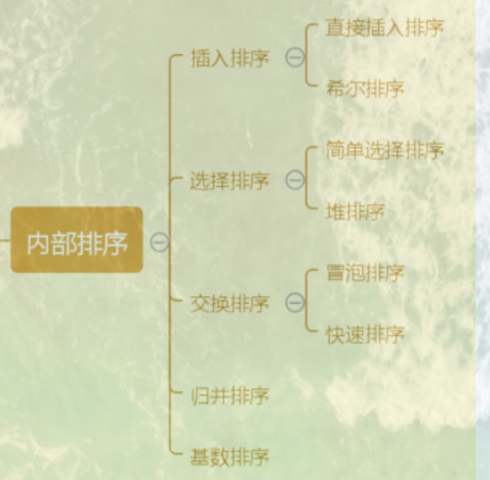
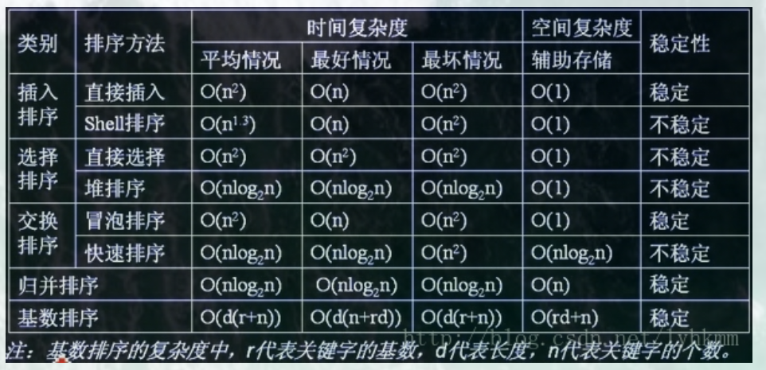

# 基础算法

如果你的时间很少。

只需认真专研这一篇足够了。

八大排序、地杰斯特拉、最小生成树。

树的遍历、深度优先、广度优先。

一文胜十题。

## 八大排序



### 交换排序

#### 冒泡排序

```javascript
//冒泡排序
function buddleSort(arr) {
  if (!arr) return
  let len = arr.length
  for (let i = 0; i < len; i++) {
    for (let j = 0; j < len - 1 - i; j++) {
      if (arr[j] > arr[j + 1]) {
        [arr[j], arr[j + 1]] = [arr[j + 1], arr[j]]
      }
    }
  }
  return arr
}
```

#### 快速排序

快排的基准元素可选择最左侧、中间、最右侧三个元素的中位数。

```javascript
//快速排序
function quickSort(arr) {
  let len = arr.length
  if (len <= 1) return arr
  let left = [],
    right = []
  let pivotIndex = Math.floor(len / 2)
  let pivot = arr.splice(pivotIndex, 1)
  arr.forEach(item => {
    if (item < pivot) {
      left.push(item)
    } else if (item > pivot) {
      right.push(item)
    }
  })
  return quickSort(left).concat(pivot, quickSort(right))
}

```

### 选择排序

#### 简单选择排序

```javascript
//简单选择排序
function chooseSort(arr) {
  let len = arr.length
  if (len <= 1) return arr
  for (let i = 0; i < len; i++) {
    for (let j = i + 1; j < len; j++) {
      if (arr[j] < arr[i]) {
        [arr[i], arr[j]] = [arr[j], arr[i]]
      }
    }
  }
  return arr
}
```

#### 堆排序

```javascript
function shiftDows(i, len, arr) {
  let temp = arr[i]
  for (let j = 2 * i + 1; j < len; j = 2 * j + 1) {
    // 找到子节点较大的
    if (arr[j + 1] > arr[j] && j + 1 < len) {
      j = j + 1
    }
    if (temp < arr[j]) {
      [arr[i], arr[j]] = [arr[j], arr[i]]
      i = j
    }
  }
}

function heapSort(arr) {
  let len = arr.length
  if (len <= 1) return arr
  // 构建大根堆
  for (let i = Math.floor(len / 2); i >= 0; i--) {
    shiftDows(i, len, arr)
  }
  // 循坏排序
  for (let i = len - 1; i >= 0; i--) {
    [arr[0], arr[i]] = [arr[i], arr[0]]
    shiftDows(0, i, arr)
  }
  return arr
}
```

### 插入排序

#### 直接插入排序

```javascript
//简单插入排序
function insertSort(arr) {
  let len = arr.length
  if (len <= 1) return arr
  for (let i = 1; i < len; i++) {
    let temp = arr[i]
    let j = i - 1
    while (j >= 0 && arr[j] > temp) {
      arr[j + 1] = arr[j]
      j--
    }
    arr[j + 1] = temp
  }
  return arr
}
```

#### `Shell`排序

```javascript
//shell排序
function shellSort(arr) {
  let len = arr.length
  if (len <= 1) return arr
  let gap = Math.floor(len / 2)
  for (gap; gap >= 1; gap = gap / 2) {
    for (let i = gap; i < len; i++) {
      let temp = arr[i]
      let j = i - gap
      while (j >= 0 && arr[j] > temp) {
        arr[j + gap] = arr[j]
        j = j - gap
      }
      arr[gap + j] = temp
    }
  }
  return arr
}
```

### 归并排序

```javascript
//归并排序
function merge(arr) {
  let len = arr.length
  if (len <= 1) return arr
  let pivotIndex = Math.floor(len / 2)
  let left = arr.slice(0, pivotIndex),
    right = arr.slice(pivotIndex, len)
  return mergeSort(merge(left), merge(right))
}

function mergeSort(leftNode, rightNode) {
  let res = []
  while (leftNode.length !== 0 && rightNode.length !== 0) {
    if (leftNode[0] < rightNode[0]) {
      res.push(leftNode.shift())
    } else {
      res.push(rightNode.shift())
    }
  }
  return res.concat(leftNode).concat(rightNode)
}
```

### 计数排序

```javascript
//计数排序
function countingSort(arr) {
  let len = arr.length,
    value = Math.max(...arr)
  if (len <= 1) return arr
  let temp = new Array(value + 1).fill(0)
  let res = [],
    resIndex = 0
  arr.forEach(item => {
    temp[item]++
  })
  temp.forEach((item, index, arr) => {
    while (item > 0) {
      res[resIndex++] = index
      item--
    }
  })
  return res
}
```

### 总结八大排序




## 树

### 三种遍历

### 深度优先

使用递归的方法。

```javascript
//深度优先
function dfs(node,list=[]){
 	if(node){
       list.push(node)
       let childrenList = node.children
       //递归遍历每个子节点
       childrenList.forEach(item =>{
           dfs(item,list)
       })
    }   
	return list
}
```

### 广度优先

队列的特性，先入先出。

```javascript
//广度优先
  function bfs(node) {
    let res = []
    if (node) {
      let queue = []
      queue.unshift(node)
      while (queue.length !== 0) {
        let item = queue.shift()
        res.push(item)
        let children = item.children
        for (let i = 0; i < children.length; i++) {
          queue.push(children[i])
        }
      }
    }
    return res
  }
```

## 图

### 迪杰斯特拉算法

https://blog.csdn.net/sinat_36521655/article/details/82085936

### 最小生成树算法

## 背包问题

```javascript
function knapsack(weights, values, w){
    var n = weights.length -1;//获取物品个数
    var f=[[]];//定义f的矩阵
    for(var j=0;j<=w;j++){
        if(j<weights[0]){//容量当不下物品0的重量，价值为0
        f[0][j]=0;
        }else{
            f[0][j]=values[0];//否则容量为物品0的价值
            }
        }
    for(var j=0;j<=w;j++){
        for(var i=1;i<=n;i++){
            if(!f[i]){//创建新的一行
                f[i]=[];
            }
            if(j<weights[i]){//等于之前的最优值
                f[i][j]=f[i-1][j];
            }else{
                f[i][j]=Math.max(f[i-1][j],f[i-1][j-weights[i]]+values[i]);
                }
            }
        }
    return f[n][w];
}
```


