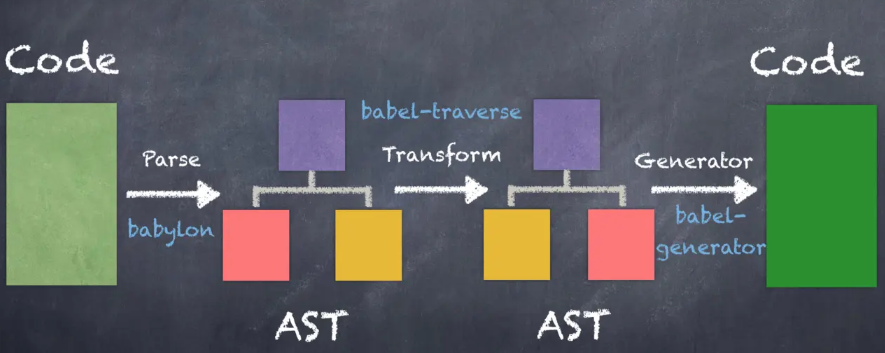
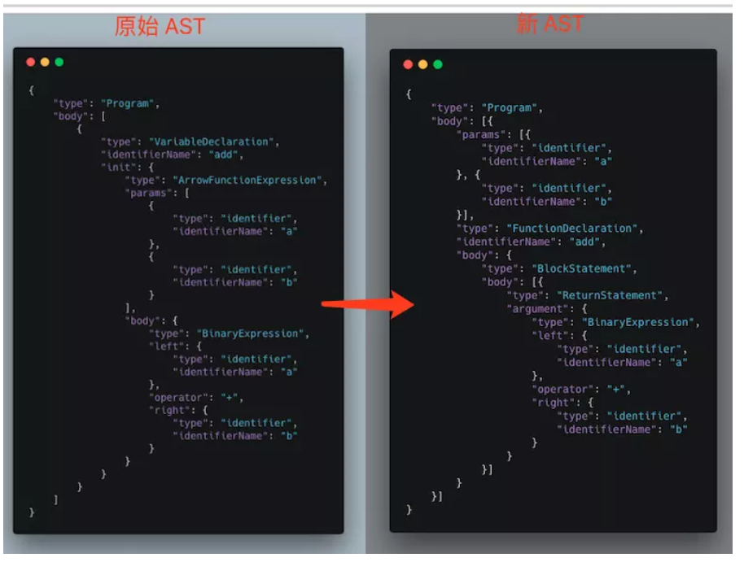

# 初步了解`Babel`

对于`Babel`，我们大家都很了解，它是一种现代的`JavaScript`的语法转换器。

而在`Babel`背后，它为我们做了什么？

来看文章吧~

## `Babel`的过程

要了解`Babel`，下面的图会很直观清楚。

`Babel`在执行中，会经历三个阶段。

阶段一：将`code`代码解析`parse`成为`AST`抽象语法树。

阶段二：将`AST`抽象语法树进行`transformer`转换成新的`AST`抽象语法树。

阶段三：根据新的`AST`抽象语法树`generator`生成所得`code`代码。



## 代码解析`Parse`

1. `parse`

在`babel`的代码解析过程中，将代码解析成一个`AST`的抽象语法树的数据结构。

如下`ES6`代码：

```javascript
const add = (a, b) => a + b
```

将被`parse`解析成

```javascript
{
  "type": "File",
  "start": 0,
  "end": 27,
  "loc": {
    "start": {
      "line": 1,
      "column": 0
    },
    "end": {
      "line": 1,
      "column": 27
    }
  },
  "program": {
    "type": "Program",
    "start": 0,
    "end": 27,
    "loc": {
      "start": {
        "line": 1,
        "column": 0
      },
      "end": {
        "line": 1,
        "column": 27
      }
    },
    "sourceType": "module",
    "body": [
      {
        "type": "VariableDeclaration",
        "start": 0,
        "end": 27,
        "loc": {
          "start": {
            "line": 1,
            "column": 0
          },
          "end": {
            "line": 1,
            "column": 27
          }
        },
        "declarations": [
          {
            "type": "VariableDeclarator",
            "start": 6,
            "end": 27,
            "loc": {
              "start": {
                "line": 1,
                "column": 6
              },
              "end": {
                "line": 1,
                "column": 27
              }
            },
            "id": {
              "type": "Identifier",
              "start": 6,
              "end": 9,
              "loc": {
                "start": {
                  "line": 1,
                  "column": 6
                },
                "end": {
                  "line": 1,
                  "column": 9
                },
                "identifierName": "add"
              },
              "name": "add"
            },
            "init": {
              "type": "ArrowFunctionExpression",
              "start": 12,
              "end": 27,
              "loc": {
                "start": {
                  "line": 1,
                  "column": 12
                },
                "end": {
                  "line": 1,
                  "column": 27
                }
              },
              "id": null,
              "generator": false,
              "expression": true,
              "async": false,
              "params": [
                {
                  "type": "Identifier",
                  "start": 13,
                  "end": 14,
                  "loc": {
                    "start": {
                      "line": 1,
                      "column": 13
                    },
                    "end": {
                      "line": 1,
                      "column": 14
                    },
                    "identifierName": "a"
                  },
                  "name": "a"
                },
                {
                  "type": "Identifier",
                  "start": 16,
                  "end": 17,
                  "loc": {
                    "start": {
                      "line": 1,
                      "column": 16
                    },
                    "end": {
                      "line": 1,
                      "column": 17
                    },
                    "identifierName": "b"
                  },
                  "name": "b"
                }
              ],
              "body": {
                "type": "BinaryExpression",
                "start": 22,
                "end": 27,
                "loc": {
                  "start": {
                    "line": 1,
                    "column": 22
                  },
                  "end": {
                    "line": 1,
                    "column": 27
                  }
                },
                "left": {
                  "type": "Identifier",
                  "start": 22,
                  "end": 23,
                  "loc": {
                    "start": {
                      "line": 1,
                      "column": 22
                    },
                    "end": {
                      "line": 1,
                      "column": 23
                    },
                    "identifierName": "a"
                  },
                  "name": "a"
                },
                "operator": "+",
                "right": {
                  "type": "Identifier",
                  "start": 26,
                  "end": 27,
                  "loc": {
                    "start": {
                      "line": 1,
                      "column": 26
                    },
                    "end": {
                      "line": 1,
                      "column": 27
                    },
                    "identifierName": "b"
                  },
                  "name": "b"
                }
              }
            }
          }
        ],
        "kind": "const"
      }
    ],
    "directives": []
  }
}

```

在这个`Parse`的过程中，将会发生**词法分析**与**语法分析**两个阶段。

2. 词法分析

将`code`代码分割成`token`流，生成**语法单元**的数组。

关于语法单元，在`JavaScript`中大多代码均是**语法单元**

+ 数字
+ 括号，包括`()`,`[]`,`{}`
+ 代码标识，声明变量、判断语句等均是
+ 运算符

举个栗子，这段`ES6`的代码经过词法分析后得到的语法单元将会是。

```javascript
const add = (a, b) => a + b
```

```javascript
[ { type: 'identifier', value: 'const' },
  { type: 'whitespace', value: ' ' },
  { type: 'identifier', value: 'add' },
  { type: 'whitespace', value: ' ' },
  { type: 'operator', value: '=' },
  { type: 'whitespace', value: ' ' },
  { type: 'parens', value: '(' },
  { type: 'identifier', value: 'a' },
  { type: ',', value: ',' },
  { type: 'whitespace', value: ' ' },
  { type: 'identifier', value: 'b' },
  { type: 'parens', value: ')' },
  { type: 'whitespace', value: ' ' },
  { type: 'ArrowFunctionExpression', value: '=>' },
  { type: 'whitespace', value: ' ' },
  { type: 'identifier', value: 'a' },
  { type: 'whitespace', value: ' ' },
  { type: 'operator', value: '+' },
  { type: 'whitespace', value: ' ' },
  { type: 'identifier', value: 'b' } ]
```

3. 语法分析

在语法分析阶段，我们需要对之前词法分析得到的**语法单元**进行逻辑分析，得到代码的真实逻辑。

具体内容颇为复杂，大体思路就是判断**语法单元**属于变量声明、表达式、语句、返回值还是运算语句等。

而判断得到**语法单元**的类型后还需要进一步分析，如果为表达式，是判断`if`还是循环，如果是循环是`while`还是`for`。。。

在语法分析过后这段`ES6`的代码也就变成了

```javascript
const add = (a, b) => a + b
```

```javascript

{
    "type": "Program",
    "body": [
        {
            "type": "VariableDeclaration",
            "identifierName": "add",
            "init": {
                "type": "ArrowFunctionExpression",
                "params": [
                    {
                        "type": "identifier",
                        "identifierName": "a"
                    },
                    {
                        "type": "identifier",
                        "identifierName": "b"
                    }
                ],
                "body": {
                    "type": "BinaryExpression",
                    "left": {
                        "type": "identifier",
                        "identifierName": "a"
                    },
                    "operator": "+",
                    "right": {
                        "type": "identifier",
                        "identifierName": "b"
                    }
                }
            }
        }
    ]
}
```


至此整个`parse`阶段也就完成了，实现了对`ES6`语句的解析，根据词法分析和语法分析得到了`AST`抽象语法树。

## 代码转换`Transformer`

在这一步也就是整个`Babel`的核心。

将原代码得到的`AST`抽象语法树`transformer`转化生成新的`AST`抽象语法树。

按之前的例子也就是将初始的`ES6`得到的`AST`抽象语法树转换生成满足`JavaScript`规范的`AST`抽象语法树。

就像这张图一样。



## 代码生成`Generator`

最后一步也就是将我们得到的新的`AST`语法生成树代码生成`Generator`得到所需的函数。

```javascript
const add = (a, b) => a + b
// function add(a,b) {return a + b}
```


