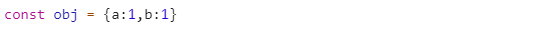
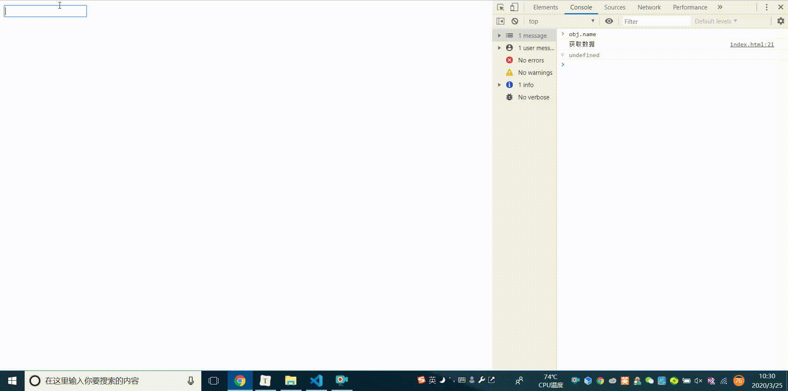
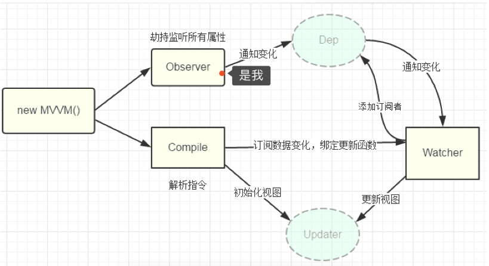
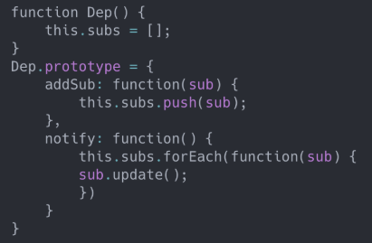

# `Vue`的响应式探寻

在昨天的腾讯面试过程中，发现自己对`vue`的响应式以及虚拟`DOM`的`diff`算法理解并不深刻，来重新总结一下。

## 数据响应式原理


说到`vue`响应式原理，最好的答案就是上图，过程也是如下三步。

+ `Vue`通过`Object.defineProperty()`定义`getter`和`setter`方法，实现数据劫持。
+ 在每个`Vue`组件的实例中都维护一个`watcher`实例，在渲染过程中将将数据通过`getter`收集成依赖。
+ 当数据发生更新时，触发`setter`方法，通知`watcher`，从而进行虚拟`DOM`的重新渲染。

说到这些，已经很熟悉了，但能不能继续探索呢。

别急，向下看~

### 基本概念

1. `setter`和`getter`

   要理解这个首先明确对象属性这个概念

   > 对象有两种属性：（1）数据属性，也就是我们常用的属性。（2）访问器属性，也成存取器属性。

   来看这样的代码

   

   执行结果如下

   

   对于这个`obj`对象而言，`a`和`b`也就是数据属性。而`get`与`set`对应着存取器属性，实现对值的获取与设置。

2. `Object.defineProperty()`

   `Object.defineProperty()`用于对对象属性与值的定义和修改。

   语法格式如下

   `Object.defineProperty(obj,prop,descriptor)`

   看一个例子，已经有了双向绑定的影子。

   ```javascript
   //low 版本双向绑定
   let obj = {}
   Object.defineProperty(obj, "name", {
     get: function () {
       console.log("获取值")
     },
     set: function (newValue) {
       console.log("设置值", newValue)
     }
   })
   obj.name = "111"	//设置值 111
   obj.name			//获取值
   ```

### 数据劫持`Observer`

再来回顾一下

> `Vue`采取数据劫持和发布/订阅者模式来实现双向绑定。通过`Object.defineProperty()`实现对数据的劫持，当数据改变时通知订阅者，订阅者触发响应回调，更新视图。

在此我们借助之前的`Object.defineProperty()`配和一个事件监听实现一个`low`版的双向绑定。

```html
<input type="text" id="input">
<br>
<span id="span"></span>
<script>
  let input = document.getElementById("input")
  let span = document.getElementById("span")
  let obj = {}
  //数据劫持
  Object.defineProperty(obj, "name", {
    get: function () {
      console.log("获取数据")
    },
    // Model -> View
    set: function (newValue) {
      //改变数据通知订阅者
      //触发响应回调、更新视图
      input.value = newValue
      span.innerText = newValue
    }
  })
  // View -> Model
  input.addEventListener("input", function (e) {
    obj.name = e.target.value
  }, false)
</script>

```



至此，我们实现了一个low版的双向绑定。

但深入来看的话，我们遗漏了一些东西。

如下图一样，我们实现的仅仅是数据劫持的`Observer`部分。

那对于编译的`Compile`和对依赖收集后的发布订阅`Watcher`又是什么？

继续看下去。



### 发布订阅

#### 依赖管理`Dep`

**一句话概括：数据触发`set`方法时循环更新依赖管理`Dep`的订阅者**

在提到解析指令`Compile`之前要先明确一个依赖管理`Dep`的概念。

依赖管理`Dep`中采用发布-订阅者模式来进行每个会涉及到双向绑定指令的管理。

就像下图一样。



**准确来讲，`vue`中比如`v-model`、`{{}}`都会进行双向绑定。而每注册这样一个指令后都会在依赖管理`Dep`中添加一个订阅者，当`set`方法被触发时将会动态更新依赖管理`Dep`的订阅者。**

#### 解析指令`Compile`

**一句话概括：解析模板指令，将变量替换成数据**

解析指令有一下两个步骤

+ 页面初始化阶段进行渲染
+ 为节点绑定更新函数`update()`,为`Dep`依赖管理中添加订阅者。


#### `Watcher`

每个`Vue`组件实例均对应一个`Watcher`实例对象。

`Watcher`实例对象接受到依赖管理`Dep`中依赖的通知变化，并绑定解析指令`Compile`的更新函数，当触发`setter`方法后最后由`watcher`对象进行`Dom`的更新，组件的重新渲染。

### `Object.defineProperty()`的缺点

`Vue3.0`中改使用`Proxy`代理来实现响应式，而不使用`Object.defineProperty()`。

好处如下：

1. 新标准

   `proxy`作为一种新的标准长远来看会有优化，而`set`和`get`并不具备。

2. 遍历对象与代理对象

   + `Object.defineProperty()`将会遍历对象的每一个属性，而`Proxy`是对象的代理处理。

   + `Objcet.defineProperty()`对于新增的对象属性需要手动进行处理，因为其遍历对象每一个属性的特点，因此对于新增的属性需要使用`vm.$set`进行设置。


