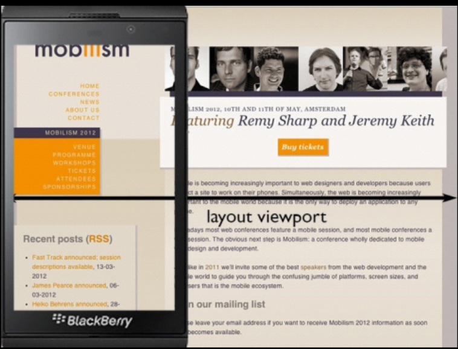
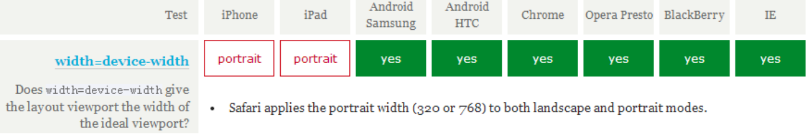
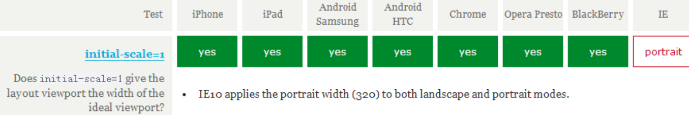

# 移动端适配

随着H5的出现，Web开发者不仅仅要关注与PC端的内容，更要注重在移动Web端的适配处理。

`meta`各个属性的含义

## `viewport`详解

[TOC]


1. 三种`view port`

   + ``layout viewport`

     ​	`layout viewport`是浏览器实际的`viewport`

     

   + `visual viewport`

     `visual viewport`是浏览器可视区的大小。

     

   + `ideal viewport`

     理想`view port`。完美适配，在任何设备上不需缩放、不显示滚动条均正常显示。且`px`的大小不会因为屏幕原因过小。

2. 使用`meta`设置`viewport`

   `meta viewport`最早由`Safari`引入，用于解决移动端适配问题，后被各大厂商所借鉴。

   ```html
   <meta name = "viewport" content="width=device-width,minimum-scale=1.0,maximum-scale=1.0,initial-scale=1,user-scalable=0">
   ```

   + `meta`的各个属性

     |     属性      |                       含义                        |
     | :-----------: | :-----------------------------------------------: |
     |     width     | 设置`layout viewport`为整数或字符串"width-device" |
     | minimum-scale |                 允许最小缩放比例                  |
     | maximum-scale |                 允许最大缩放比例                  |
     | initial-scale |       初始缩放比例(相对于`ideal viewport`)        |
     |  user-scale   |                   是否允许缩放                    |

   + 将`meta viewpoint`中的`width`设为`ideal viewport`

     要得到`ideal viewport`就需要将`width`也就是`layout viewport`设置成屏幕宽度。

     - 因此就有了`<meta name="viewport" content="width=device-width">`。但对`ipad`和`iPhone`来说均是竖屏宽度。

       

     - 同样设置`<meta name="viewport" content="initial-scale=1.0">`但会对`IE`不兼容。

       

     - 综合来看，想得到`ideal viewport`，需要将两个设置相结合。得到`<meta name="viewport" content="width=device-width initial-scale=1.0">`

## 传统`rem`布局

**思路：先通过`meta viewport`设置整体为`ideal viewport`。紧接着设置`html`元素中的`font-size`大小来实现用`rem`控制不同设备中元素的布局**

```html
<meta name="viewport" content="width=device-width initial-scale=1.0">
<style></style>
<div style="width=10rem"></div>
<script>
    window.onresize = function getRem(){
        document.documentElement.style.fontSize = (document.documentElement.offsetWidth || document.body.offsetWidth) / 20 + "px"
    }
    // document.documentElement.style.fontSize 用于设置HTML根元素中fontSize的大小
    // document.documentElement.offsetWidth || document.body.offsetWidth 用于获取元素宽度并兼容IE
    // / 20 这项的意思是将屏幕分成20份。可自行设置。
    getRem()
</script>
```

## 手淘团队`flexible`布局

当前移动`Web`端有多项适配方案，但手淘团队的`flexible`适配方案与其他相比更为成熟。

1. 一些概念

   + 物理像素`px`(physical pixel)

     设备最微小的物理部件，通过物理像素决定展示长度与颜色。

   + 设备独立像素`dip`(density-independent pixel)

     程序的虚拟像素，可以视作物理像素`px`的抽象，最后会被转换成物理像素`px`。

   + 设备像素比`dpr`(density-pixel radio)

     定义了物理像素与设备独立像素之间的关系。可用于区分视网膜设备或非视网膜设备`Retina`。

     `dpr` = `px`/`dip`

2. 关于手淘的`flexible`布局分析

   + **第一步：**针对不同设备进行`dpr`的判断，来得到相应的缩放值`scale`

     ```javascript
     if (!dpr && !scale) {
         var isAndroid = win.navigator.appVersion.match(/android/gi);
         var isIPhone = win.navigator.appVersion.match(/iphone/gi);
         var devicePixelRatio = win.devicePixelRatio;
         if (isIPhone) {
             // iOS下，对于2和3的屏，用2倍的方案，其余的用1倍方案
             if (devicePixelRatio >= 3 && (!dpr || dpr >= 3)) {                
                 dpr = 3;
             } else if (devicePixelRatio >= 2 && (!dpr || dpr >= 2)){
                 dpr = 2;
             } else {
                 dpr = 1;
             }
         } else {
             // 其他设备下，仍旧使用1倍的方案
             dpr = 1;
         }
         scale = 1 / dpr;
     }
     ```

   + **第二步：**为根元素自定义`data-dpr`属性。

   + **第三步：**为页面添加动态的`meta`标签，并设置其`scale`值与`html`根元素的`fontSize`

     ```javascript
       docEl.setAttribute('data-dpr', dpr); // 给页面根元素设置自定义属性data-dpr，值为前面已经赋值好的dpr
         if (!metaEl) { // 当name=viewport的mate标签不存在时，就给页面添加一个，各元素值为前面计算好的scale，并不允许用户拖动缩放
             metaEl = doc.createElement('meta');
             metaEl.setAttribute('name', 'viewport');
             metaEl.setAttribute('content', 'initial-scale=' + scale + ', maximum-scale=' + scale + ', minimum-scale=' + scale + ', user-scalable=no');
             if (docEl.firstElementChild) {
                 docEl.firstElementChild.appendChild(metaEl);
             } else {
                 var wrap = doc.createElement('div');
                 wrap.appendChild(metaEl);
                 doc.write(wrap.innerHTML);
             }
         }
     ```


## 其他兼容问题

### 图片的适配

当图片所在父容器较大时，可能会造成变形。因此需要设置`max-width`进行处理。

```css
img{
    width:100%
    max-width:300px
}
```

### 媒体查询

`CSS3`新增的媒体查询可对不同设备进行处理。同样也是`boostrap`的原理所在。

### `click`的300ms延迟

`Safari`中两次点击在300ms以内会进行放大处理。因此`click`事件会产生300ms的延迟。

解决方法

+ 一：禁止缩放`user-scalable=no`
+ 二：通过`<meta name="viewport" content="width=device-width initial-scale=1.0">`实现`ideal viewport`，完全适配移动端不需缩放。
+ 三：通过`DOM`事件响应`touchend`，并且阻拦300ms后`click`的事件。

### 点击穿透问题

如下条件将触发点击穿透问题

`touchstart`->`touchend`->`click`

当A元素在B元素之上，A元素`touchend`响应后隐藏，300ms后`click`事件触发，导致B的点击。


