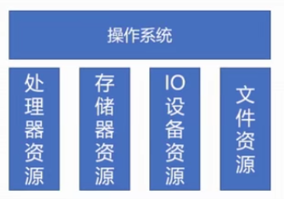
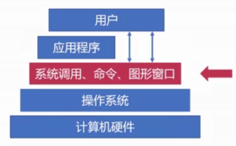
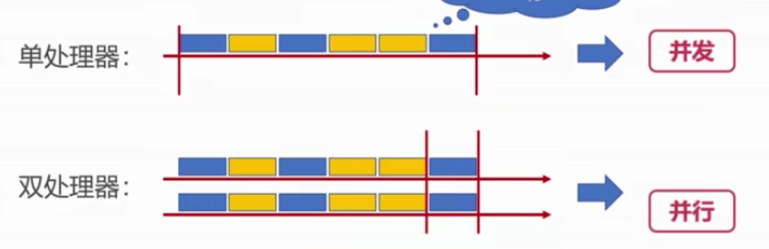
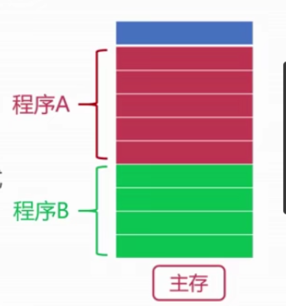

# 操作系统概览

## `What`&&`Why`

1. OS是管理计算机**硬件和软件、提供人机交互界面**的软件。
   + OS系统存在与不同设备中（PC、手机、超级计算机）

2. `Why`
   + 需要OS来操作计算机硬件
   + 统一不同设备的界面
   + 让计算机的使用变得简易

## 操作系统的基本功能

1. OS统一管理计算机资源（处理器资源、存储器资源、I/O设备资源、文件资源）

   

2.  OS实现对计算机资源的抽象（OS管理软件，提供对计算机资源的接口）

3. **OS提供用户和计算机之间的接口**

   + 命令行、图像、系统调用

   

## 操作系统相关概念

1. 并发性（前提）
   + 并发（多个事件在**同一时间间隔**发生） VS 并行（多个事件在同一时刻发生）

     

2. 共享性

   + 资源共享：OS资源可供并发的程序使用

     

   + 共享形式：互斥共享、同时访问

3. 虚拟性

   + 物理实体转换成若干逻辑实体
   + 时分复用
     + 多道程序分时使用计算机资源（提高资源利用率）
     + 方式一：虚拟处理器技术（每个程序建立进程，进程并发访问）
     + 方式二：虚拟设备技术（物理设备分成多个逻辑设备，程序并发访问逻辑设备 ）

   + 空分复用
     + 虚拟磁盘、虚拟内存（提高资源利用率）

4. 异步性

   + 多道程序环境下，允许多个进程并发执行
     + 意味着进程使用资源时可能会等待或放弃
     + 进程的执行会不断中断（不可预知）

