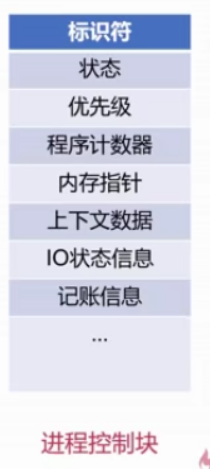
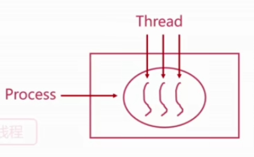
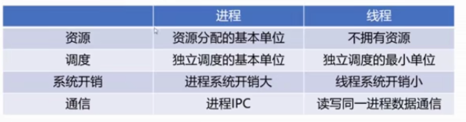

# 进程管理之进程实体

## `Why`进程

1. **进程是系统资源分配和调度的基本单位**
2. 进程作为程序独立运行的载体保证
3. 进程使得OS资源利用率提高

## 进程实体

1. 主存中的进程形态

   + 进程控制块（PCB）：描述控制进程运行的数据结构。**常驻内存中。**

   

   + 标识符：进程ID。
   + 状态：标记进程的状态（运行态、阻塞态）
   + 程序计数器：指向进程执行下一条指令的地址
   + 内存指针：指向程序代码、进程数据
   + 上下文数据：进程执行时处理器存储的数据
   + IO状态信息：被进程IO操作所占用的文件列表
   + 记账信息：处理器时间、时钟等

2. 进程与线程

   ​	

   + 进程（Process）：OS进行资源分配和调度的基本单位

   + 线程（Thread）：OS进行运行调度的最小单位

     + 线程共享进程的资源

   + **一个进程可并发多个线程，每个线程执行不同的任务**

     

     