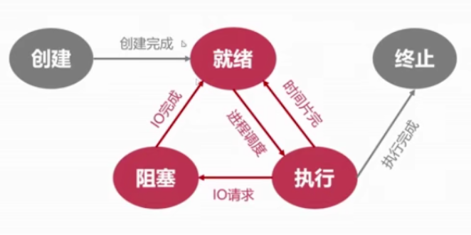

# 进程管理之状态模型

## 五状态模型

1. 就绪状态

   + 其他资源就绪，只差CPU资源的状态。

   + 就绪队列。

     

2. 执行状态
   + 就绪态进程获得CPU使用权
     + 单处理器中，某一时刻只能有一个进程处于执行状态

3. 阻塞状态

   + 其他设备未就绪，进程放弃CPU使用权

   + 阻塞队列

     

4. 创建状态
   + 进程拥有PCB但其他资源尚未就绪
   + 分配PCB -> 插入就绪队列

5. 终止状态
   + 进程结束由系统清理或归还PCB
   + 系统清理 -> 归还CPB

6. 状态切换

