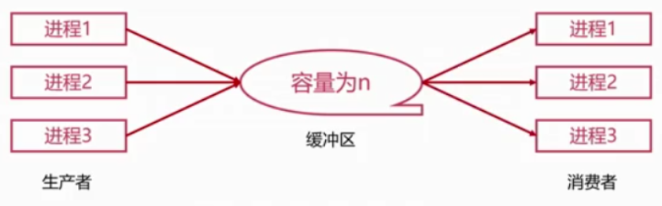

# 进程管理之进程同步

## `Why`进程同步

1. 生产者消费者问题

   

   + 通过寄存器和缓冲区来实现。

     

2. 哲学家进餐问题

   

3. 进程的同步
   + 两个模型的问题：彼此没有通信（需要进程间同步）
   + 进程间同步：
     + 竞争资源在多进程间协调

## 进程同步的原则

1. 临界资源：共享资源 + 互斥访问
2. 四个原则：
   + 空则让进
   + 忙则等待
   + 有限等待
   + 让权等待：等待时，进程需要让出CPU

3. 三个方法：
   + 消息队列
   + 共享内存
   + 信号量

## 线程同步

1. 多线程也需要同步
2. 线程同步的方法
   + 互斥量
   + 读写锁
   + 自旋锁
   + 条件变量

