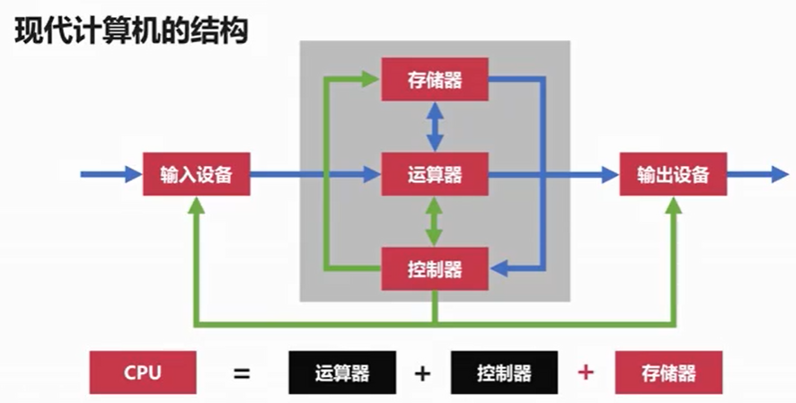

# 第一章——计算机的背景

## 计算机发展简史

1. 计算机发展的四个阶段

   + 电子管计算机->晶体管计算机->集成电路计算机->超大规模集成电路计算机

   

   + 电子管计算机

     二战的产生物

     埃尼阿克（ENIAC）

   + 晶体管计算机

     贝尔实验室发明晶体管

     PDP-1（4K内存）

   + 集成电路计算机

      德州仪器工程师发明集成电路

     IBM7904和IBM1401互斥产生了操作系统

   + 超大规模集成电路计算机

     Jobs发明Apple和Apple2.0进入个人计算机时代

   + 未来计算机
     + 生物计算机
     + 量子计算机

2. 微型计算机的发展历史

   + 早期单核CPU受限于性能。

     21世纪前，单核CPU的性能受限于摩尔定律（每18-24个月集成电路的性能将会提升一倍）。

     21世纪后，摩尔定律由于集成密集，热损耗严重逐渐失效。

   + 多核CPU

## 计算机的分类

1. 超级计算机

   运算速度最快、存储量最大。

2. 大型计算机

   高性能、可处理大量数据与复杂运算。

   去`IOE`行动（阿里巴巴），将集中式的`Oracle`改成分布式`MySql`。

3. 小型机（普通服务器）
4. 工作站
5. 微型计算机（个人计算机）

## 计算机的体系结构

1. 冯诺依曼体系

   **程序指令和数据一起存储。**

   + 存储程序指令，设计通用电路。

   + 存储器、控制器、运算器、输入/输出设备。

     

   + 冯诺依曼瓶颈

     CPU和存储器的处理速度差距较大，CPU经常空转等待数据传输。

2. 现代计算机体系

   **解决CPU和存储器的速度差距**

   

   以存储器（CPU寄存器、内存、磁盘）为核心。