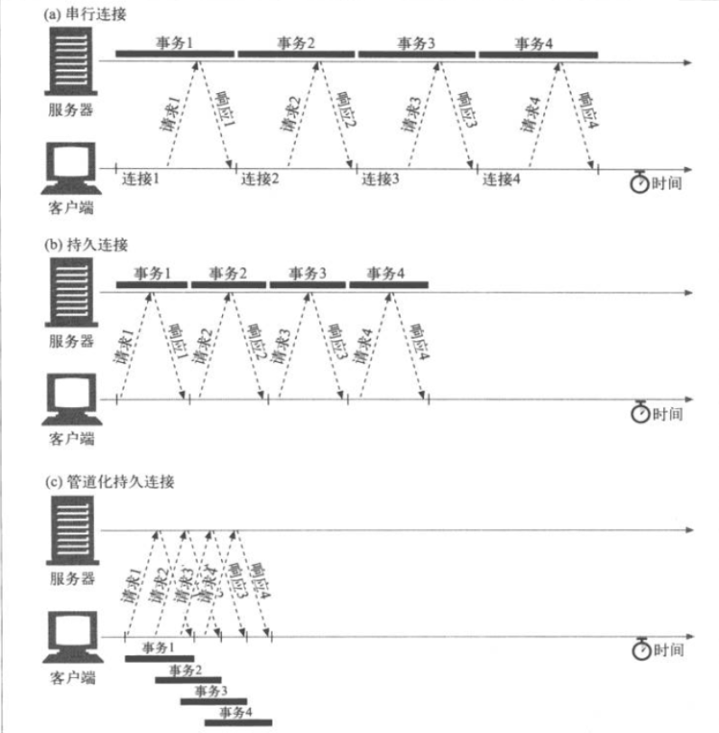
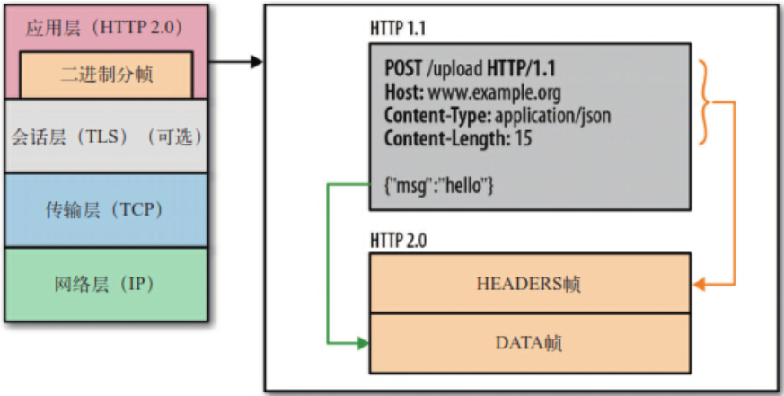
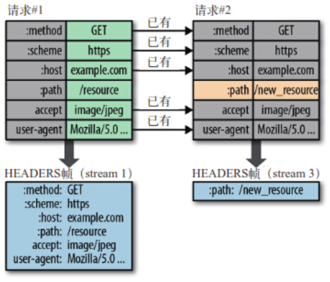

# 深入理解`HTTP`

`HTTP`，一个在应用层的协议。极其重要。

涉及到`HTTP`的相关知识来看下文吧~

## `HTTP1.0`到`HTTP2.0`

1. `HTTP1.0`

   单次连接单次请求，没有`host`字段，状态码较少。

2. `HTTP1.1`

   + 持续连接

     `HTTP1.0`中每次请求都会建立一次`TCP`连接，对性能而言无疑浪费。

     `HTTP1.1`中不必设置`Contention:keep-alive`就可以**默认保持持续连接**，每一次`TCP`连接可以发送响应多次`HTTP`请求。

   + 管道化连接

     `HTTP1.1`使用管道化连接对`keep-alive`进一步优化。管道化连接可以保证响应不依照请求的顺序返回。对于高延迟网络通信效果更好。

     

   + `host`字段

     `HTTP1.1`新增`host`主机名字段，用于判断服务器中具体访问的站点。

   + 新增缓存、扩充状态码

3. `HTTP2.0`

   + 二进制分帧

     

     将请求和消息压缩成二进制的帧，每个帧由头部和数据部分组成。

     使用二进制分帧可乱序发送，并重新组装。

     对于二进制分帧还需要规定其权重值，进一步提高性能。

   + 首部压缩

     `HTTP2.0`压缩首部数据，只发送修改部分的数据。

     

   + 服务器推送

     除了客户端主动请求外，服务器还可以向客户端主动进行推送。

## `HTTPS`

`HTTPS`运行在`SSL\TSL`下的安全的`HTTP`协议。

1. `HTTP`和`HTTPS`
   + `HTTP`明文传输会造成窃听、修改、伪造
   + `HTTPS`加密传输、证书认证保证安全。
   + `HTTPS`运行在`SSL\TLS`下，使用443作为端口。

2. `HTTPS`大致过程

   + 客户端请求加密公钥

   + 服务器返回公钥

   + 客户端验证公钥，协商出回话秘钥进行加密通信

3. `HTTPS`详细

   + 客户端发送协议版本、支持的加密算法、第一个随机数。
   + 服务器响应协议版本、支持的加密算法、第二个随机数、和一个**数字证书（公钥+数字签名）**。
   + 客户端获取公钥，验证数字签名，使用公钥加密第三个随机数并发送编码改变通知。
   + 服务器解密得到第三个随机数，生成回话秘钥、发送编码改变通知

4. 问题

   + 数字证书

     数字证书包括公钥与公钥加密的数字签名。

     数字签名是服务器通过`hash`算法得到的摘要，客户端可以通过公钥解密后相同的`hash`算法得到数字签名进行公钥的验证。

     

   + 为什么用回话秘钥

     公钥加密计算时间较长，因此使用公钥和三个随机数生成回话秘钥，缩短加密计算时间。

   + 为什么三次随机数

     `SSL`不相信单一的随机数，使用三次随机数可生成一个完整的随机数。

## `HTTP`方法

1. `POST`和`GET`

   + `POST`请求传递数据

     + 原生表单

       `Content-Type:application/x-www-form-urlencoded`

     + `JSON`数据

       `Content-Type:application/json`

     + 文件、图片

       `Content-Type:multipart/form-data`

     + `XML`格式的文本

       `Content-Type:text/xml`

   + 参数区别

     `POST`方法将参数携带请求体中，`GET`方法参数外露。

     `POST`方法请求的参数长度没有限制而`GET`方法对参数长度有所限制。

   + 安全性

     `POST`请求参数不外露安全性较高

     `GET`请求参数外露安全性较低。

   + `TCP`数据包

     `POST`请求发送两次`TCP`数据包，第一次服务器响应`100`后再传递具体数据。

     `GET`请求只发送一次`TCP`数据包。

2. `PUT`

   等幂操作用于修改数据

3. `DELETE`

   删除请求，响应`200`后只表示删除响应并不真正删除。

4. `OPTIONS`

   用于检测允许的请求头

   + 简单请求

     `GET`、`POST`和`HEAD`方法。

     直接进行请求校验

   + 非简单请求

     `PUT`、`DELETE`等

     先进行`OPTION`校验，若白名单继续发送`Ajax`通信	

5. `HEAD`

   返回响应首部

6. `TRANCE`

   跟踪请求路径

7. `CONNECT`

   在客户端与服务器之间建立隧道，实行`SSL`和`TLS`协议加密。

## `HTTP`状态码

`HTTP`的状态码负责表示客户端的`HTTP`请求返回结果、标记是否正常等。

1. `HTTP`状态码的类别

| 类别  |          原因          |
| :---: | :--------------------: |
| `1XX` |      请求正在处理      |
| `2XX` |    请求正常处理完毕    |
| `3XX` | 请求附带操作（重定向） |
| `4XX` |     客户端请求错误     |
| `5XX` |       服务器错误       |

2. `2XX`

|       状态码        |                  结果                  |
| :-----------------: | :------------------------------------: |
|       200 OK        |              请求正常处理              |
|   204 No Content    | 请求正常处理，响应中不返回信息`(Ajax)` |
| 206 Partial Content |   请求范围内的内容`(大型二进制文件)`   |

3. `3XX`

|        状态码        |           结果           |
| :------------------: | :----------------------: |
| 301 Move Permanently |   永久重定向(更新书签)   |
|      302 Found       | 临时重定向（不更新书签） |
|    303 See Other     |       302 + `GET`        |
|   304 Not Modified   |       命中协商缓存       |

4. `4XX`

|         状态码         |                     结果                     |
| :--------------------: | :------------------------------------------: |
|    400 Bad Request     |       报文语法错误`(HTTP1.1 host字段)`       |
|    401 Unauthorized    |                   需要认证                   |
|     403 Forbidden      | 服务器拒绝。（服务器白名单，未授权的IP地址） |
|     404 Not Found      |               请求资源路径错误               |
| 405 Method Not Allowed |       请求方法不支持（`post -> get`）        |

5. `5XX`

|          状态码           |       结果       |
| :-----------------------: | :--------------: |
| 500 Internal Server Error |  服务器内部故障  |
|  503 Service Unavailable  | 服务器过载或维护 |

